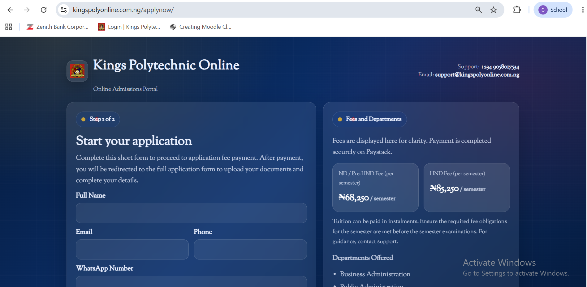
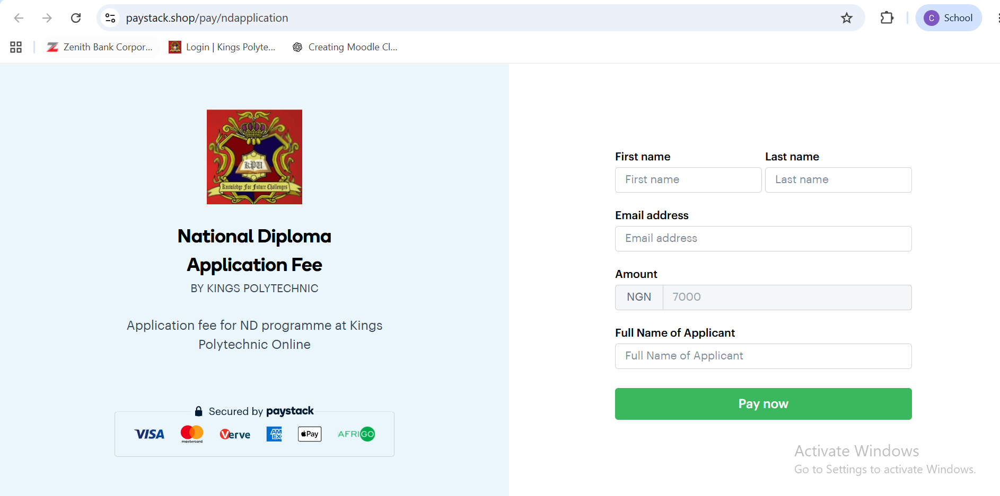
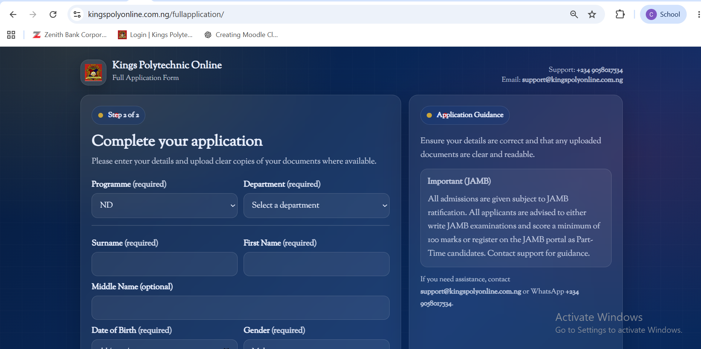
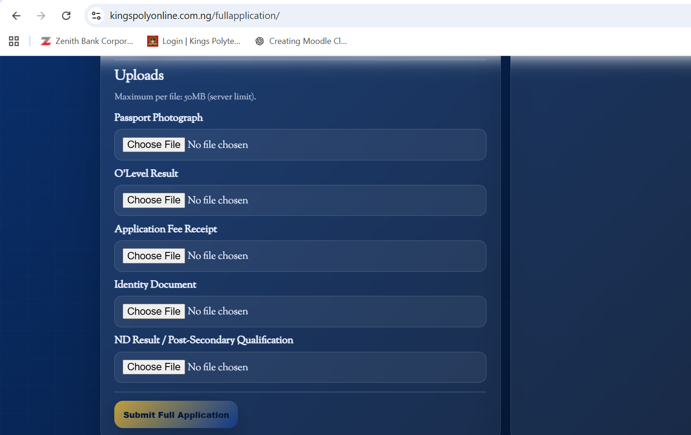

[README_application_portal.md](https://github.com/user-attachments/files/28596487/README_application_portal.md)
# Student Application Portal

> End-to-end digital admissions system built in Laravel 11 — online application, Paystack fee collection with webhook verification, document upload, admin review dashboard, and automated admission status notifications to candidates.

**Live:** Part of the Kings Poly Online ecosystem · [kingspolyonline.com.ng](https://kingspolyonline.com.ng)


---

## Overview

Kings Poly Online previously handled all student admissions manually — paper forms, bank branch payments, phone-call admission decisions. There was no audit trail, no status visibility for applicants, no structured document collection, and no way to scale.

This portal replaces the entire process with a digital pipeline from first inquiry through to admission decision, with no manual intervention required at any stage once the admin makes a decision.

---

## Application Lifecycle

```
Applicant                    System                        Admin
    │                           │                            │
    │── Fill application form ──►│                            │
    │                           │── Validate & store ────────►│
    │◄── Redirect to Paystack ──│                            │
    │                           │                            │
    │── Pay application fee ────►│ (Paystack checkout)       │
    │                           │◄── Webhook: payment verify─│
    │                           │── Mark application PAID    │
    │                           │── Queue for review ────────►│
    │                           │                            │
    │── Upload documents ───────►│── Store to secure path ───►│
    │                           │                            │
    │                           │◄── Admin reviews ──────────│
    │                           │◄── Status updated ─────────│
    │                           │                            │
    │◄── Status notification ───│ (automated dispatch)       │
    │                           │                            │
    │── Check status (login) ───►│── Return current status ──►│
```

---

## Key Technical Features

### Paystack Webhook Verification
Payment confirmation does not rely on the redirect callback (which can fail if the user closes the browser mid-transaction). Instead:
- Paystack fires a `charge.success` webhook to a dedicated endpoint
- The endpoint verifies the Paystack signature using HMAC-SHA512
- Only on verified webhook does the system mark the application as paid and queue it for admin review
- This eliminates false positives from interrupted sessions and removes any need for manual fee reconciliation

### Automated Admission Status Notifications
When an admin changes an application status — `admitted`, `rejected`, `deferred`, `awaiting_documents` — the system automatically dispatches a notification to the applicant. No staff member needs to manually communicate the outcome.

Notification content is templated per status type and includes:
- Decision outcome
- Next steps (for admitted candidates: enrollment instructions, fee payment details)
- Contact point for queries

### Document Management
- Applicants upload O-level results, NIN/identification, and supporting documents at the point of application
- Files stored in a secured, non-public directory path — not accessible via direct URL
- Admin review interface presents all documents inline alongside the application record
- Document completeness check before an application can be marked as reviewed

### Application Tracking
Applicants can return to the portal at any time using their application reference number to view their current status — removing the need for support calls asking "what happened to my application?"

### Full Audit Trail
Every event is timestamped and logged against the application record:
- Initial submission
- Payment confirmation (webhook timestamp)
- Each document upload
- Every status change (with admin ID and timestamp)

---

## Admin Dashboard

| Feature | Detail |
|---------|--------|
| Application list | Filterable by status, payment state, date range |
| Document review | Files rendered inline — no downloads required to review |
| Status management | One-click status update triggers automatic notification |
| Payment status | Live Paystack verification status per application |
| Export | CSV export of application cohort for institutional records |

---

## Database Design (Key Tables)

```sql
applications
  id, reference_no, applicant_name, email, phone,
  programme_choice, o_level_summary,
  payment_status, paystack_reference,
  status (pending|paid|under_review|admitted|rejected|deferred|awaiting_docs),
  submitted_at, reviewed_at, reviewed_by

application_documents
  id, application_id, document_type, file_path,
  uploaded_at

application_status_log
  id, application_id, previous_status, new_status,
  changed_by, changed_at, note
```

---

## Stack

- **Framework:** Laravel 11
- **Language:** PHP 8.2
- **Database:** MySQL 8.0
- **Payment:** Paystack API (checkout + webhook)
- **Frontend:** Blade templates, Tailwind CSS
- **File storage:** Local secured path (non-public)
- **Notifications:** Laravel Mail (SMTP)
- **Server:** Qservers VPS, cPanel, PHP 8.2

---

## Integration with Kings Poly Ecosystem

This portal sits alongside:
- **Moodle LMS** — admitted students are enrolled into Moodle course shells post-admission
- **Laravel Results Portal** — the same student record feeds into results management from semester one
- **Moodle SSO** — once enrolled, students use one credential across the results portal and LMS

---

## Before vs After

| Process Step | Before | After |
|---|---|---|
| Application submission | Paper form, physical delivery | Online form, any device |
| Fee payment | Bank branch, teller receipt | Paystack, instant verification |
| Document collection | Physical folder, manual filing | Digital upload, structured storage |
| Admission decision comms | Phone call per applicant | Automated notification |
| Status visibility | None | Real-time self-service |
| Audit trail | None | Full timestamped log |
| Staff time per application | High | Near-zero post-decision |

---
## Screenshots


   
   
   

---
## About

Built by **Oluwafemi Ganzallo** via **KDCS Limited** (RC 1948680), Ikeja, Lagos.  
Part of the Kings Poly Online full academic technology ecosystem.  
ORCID: [0009-0008-6198-7044](https://orcid.org/0009-0008-6198-7044)
